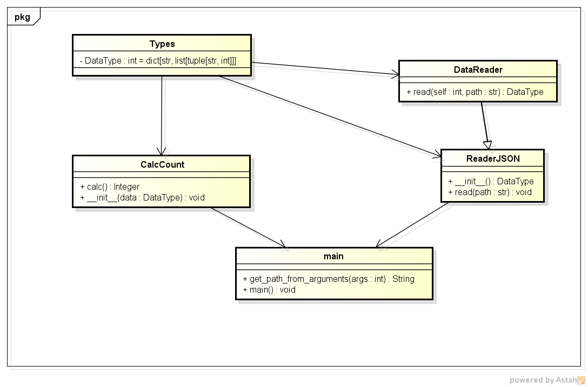

Цели работы:
1. Познакомиться c распределенной системой контроля версий кода Git и ее функциями;
2. Познакомиться с понятиями «непрерывная интеграция» (CI) и «непрерывное развертывание» (CD), определить их место в современной разработке программного обеспечения;
3. Получить навыки разработки ООП-программ и написания модульных тестов к ним на современных языках программирования;
4. Получить навыки работы с системой Git для хранения и управления версиями ПО;
5. Получить навыки управления автоматизированным тестированием программного обеспечения, расположенного в системе Git, с помощью инструмента GitHub Actions.

Описание проекта:
Данное приложение было написано с использованием языка программирования Python версии 3.10 и следующих библиотек - pytest - для создания тестов разработанных классов, для выполнения задания по обработке файла формата json использовалась соответствующая библиотека json. 

Выводы по работе:
В данной лабораторной работе было изменено приложение под собственный вариант задания, а так же использовался Git для хранения и управления версиями ПО. Так же были написаны тесты для новых разработанных классов, которые выполнялись с помощью инструмента GitHub Actions.

Диаграмма представлена ниже на картинке UML.png
